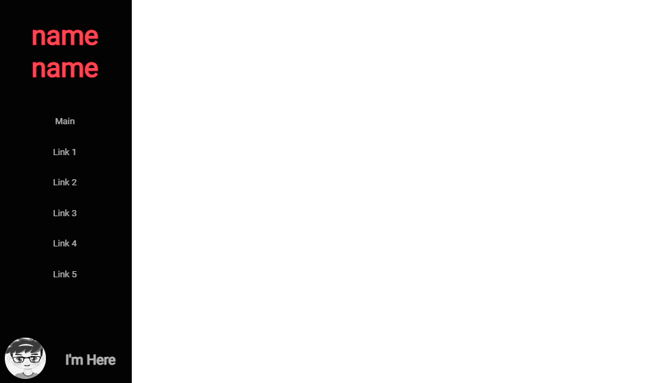
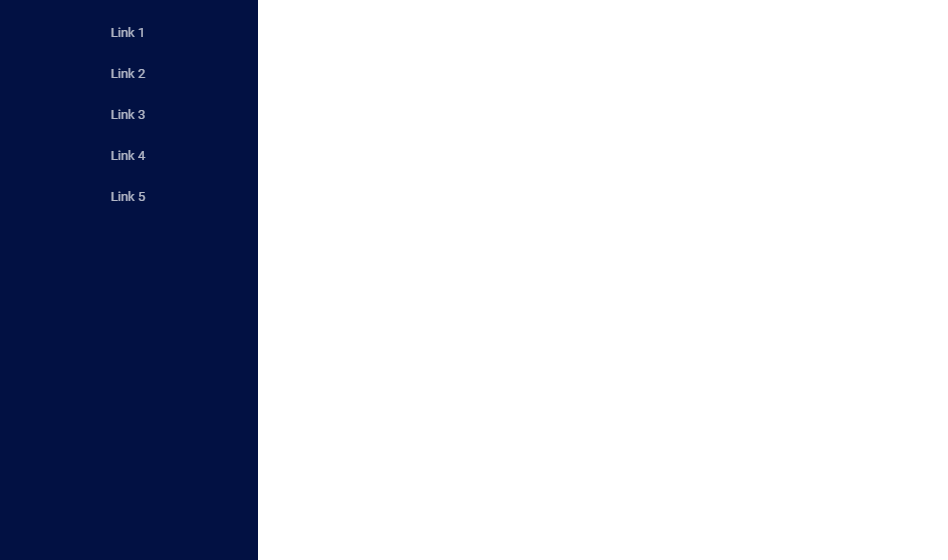
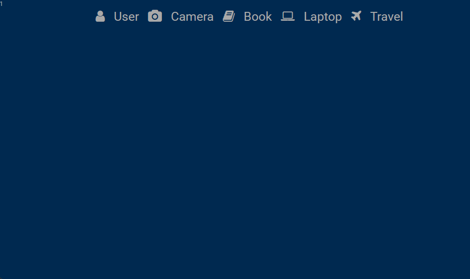
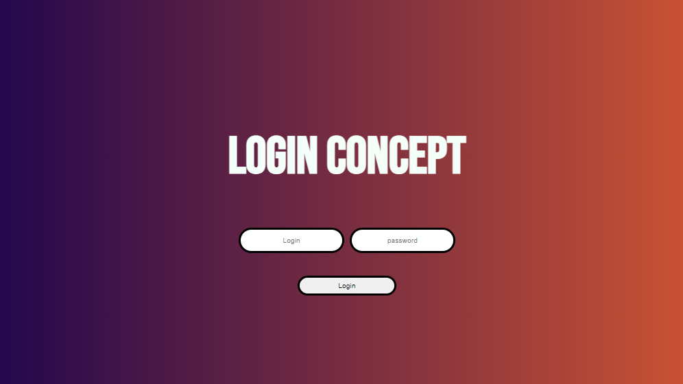
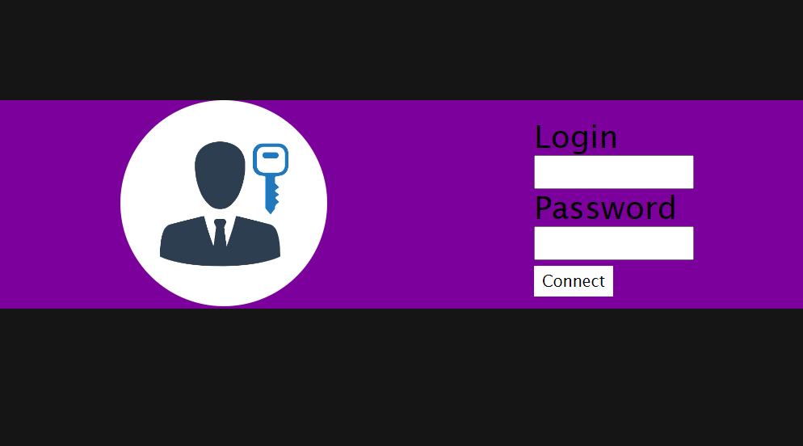
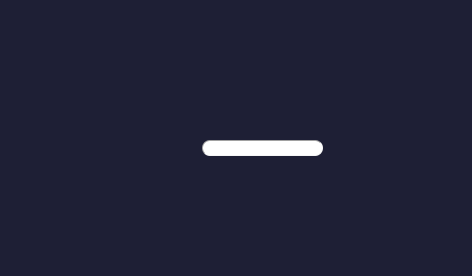
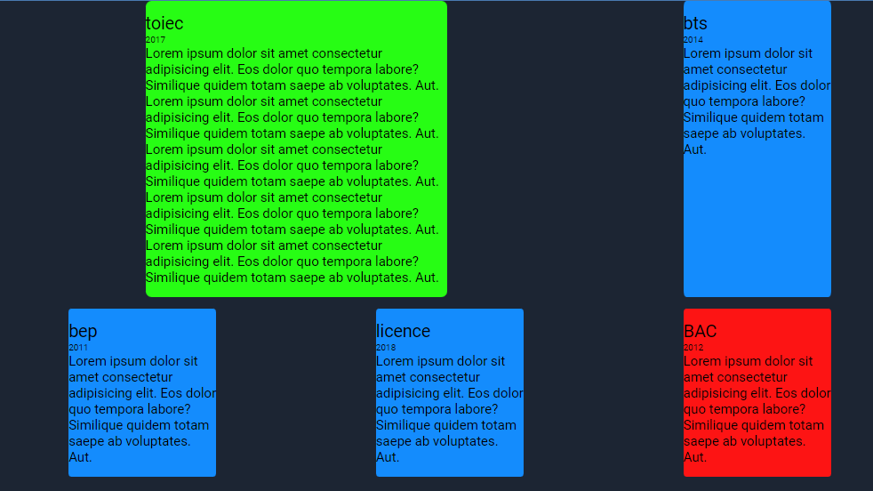
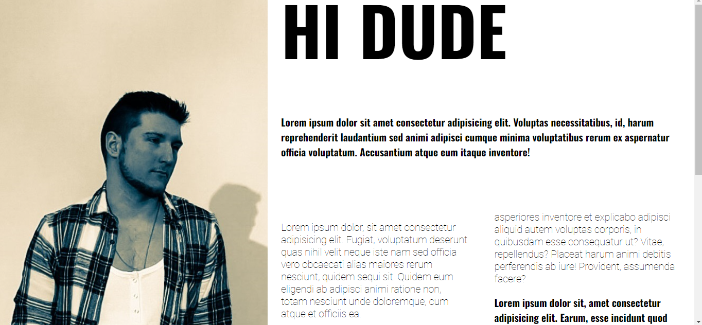
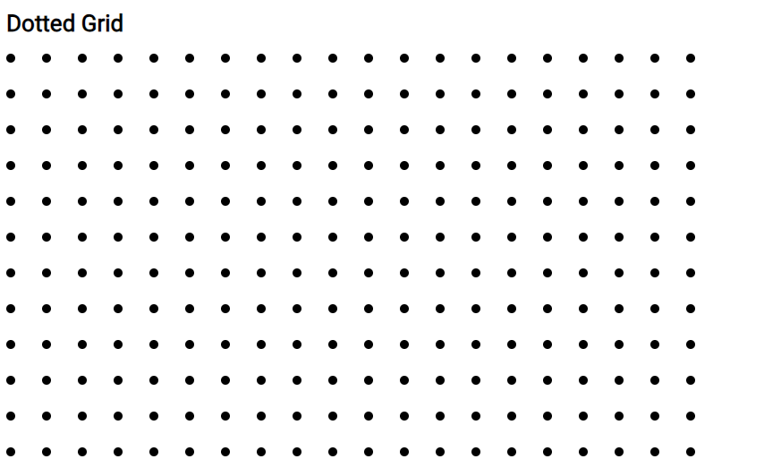

Here are a few concept. Bits of code that could be usefull for beginners. things I often use to save time. Head's up I didn't change the fonts in all the css files so you may have to download them from googlefonts

Like this nice sidebar. Copy/paste and see how you can have fun with it.
</img>
a simpler very that you can modify yourself
</img>

a website made entirely of closed section could be cool: 
</img>

Here are login Concepts
</img>
</img>

A small Search bar
</img>

A small glasseffect could be very nice! There are any filter available in the css. try to explore. 
</img>

Grid is alway a powerful tool to use in css. I learn this from Kevin Powell here's his site.
 https://www.kevinpowell.co/

</img>
</img>
</img>

